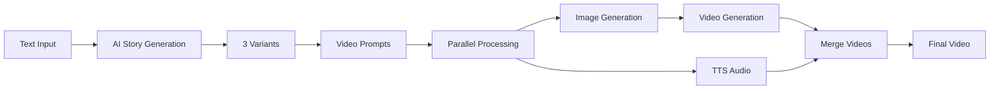

# TikToker - AI Video Generator

[](https://opensource.org/licenses/MIT)
[](https://nodejs.org/)

A powerful CLI application for automated AI-powered video generation. Create engaging short-form videos for TikTok, YouTube Shorts, and Instagram Reels in minutes.

## 🎥 Demo

[▶️ Watch Demo Video](docs/tiktoker-demo.mp4)

> See TikToker in action - from text prompt to final video in under 5 minutes!
>
> **Example output**: A 30-second video about a cyberpunk detective, generated completely from a single text prompt.

## 🔄 How It Works

TikToker uses a sophisticated AI pipeline to transform text descriptions into polished videos:



### Pipeline Stages

#### 1. **📝 Story Generation** (10-20s)
```
Input: "a cyberpunk detective solving a mystery"
        ↓
[OpenRouter API] → Claude 3.5 / Grok 4.1
        ↓
Output: 3 unique story variants (parallel generation)
```
- Generate 3 unique story variants using Claude/Grok
- Parallel generation for 3x speed
- Each variant has different temperature for diversity
- Option to write custom text instead

#### 2. **🎬 Video Prompt Creation** (5-10s)
```
Story Text
    ↓
[AI Prompt Generator]
    ↓
Segment 1: "Cinematic shot of detective, neon lights, rain..."
Segment 2: "Close-up holographic display, futuristic UI..."
Segment 3: "Wide shot cyberpunk city, dramatic lighting..."
...
```
- AI breaks story into visual segments
- Creates cinematic prompts in English
- Optimized for 4-5 second segments
- Each prompt includes: camera angle, lighting, composition

#### 3. **⚡ Parallel Asset Generation** (2-5 min)
```
        Story Text → Prompts
              ↓
    ┌─────────┼─────────┐
    ↓         ↓         ↓
[Images]  [Videos]  [Audio]
    ↓         ↓         ↓
  Flux →   Veo3   ElevenLabs
           ↓
    All complete simultaneously!
```
- **Images**: Flux Schnell generates HD images (720×1280 or 1280×720)
- **Videos**: Veo3/Seedance creates 4-5s videos from images
- **Audio**: ElevenLabs narrates with selected voice
- **Retry Logic**: Up to 3 attempts per asset with exponential backoff
- **Partial Success**: Continue even if some segments fail

#### 4. **🎞️ Post-Processing** (30-60s)
```
video_1.mp4 ─┐
video_2.mp4 ─┤
video_3.mp4 ─┼─→ [FFmpeg Merge] → merged_video.mp4
    ...      │
video_N.mp4 ─┘
                        ↓
                [FFmpeg Audio Sync]
                        ↓
                  final_video.mp4 ✅
```
- Concatenate all video segments
- Sync narration audio with video
- Export final MP4 with H.264 encoding

### ⏱️ Performance

| Duration | Segments | Sequential | Parallel | Speedup |
|----------|----------|-----------|----------|---------|
| 6 sec    | 1        | 2-5 min   | 2-5 min  | 1x      |
| 30 sec   | 5        | 10-25 min | 3-6 min  | 3-4x    |
| 60 sec   | 12       | 20-50 min | 5-10 min | 4-5x    |

**Total Time**: 3-6 minutes for a complete 60-second video

## ✨ Features

- 🎬 **Video Generation** - Veo 3.1 Fast / Seedance Lite
- 📝 **Text Generation** - Claude / Grok (via OpenRouter)
- 🔊 **Text-to-Speech** - ElevenLabs TTS with multiple voices
- 🖼️ **Image Generation** - Flux Schnell / Flux LoRA
- 📐 **Multiple Aspect Ratios** - 9:16 (TikTok/Reels) or 16:9 (YouTube)
- 🎨 **20+ Style Presets** - From photorealistic to anime
- 🎤 **Voice Selection** - 3 preset voices + custom Voice ID support
- ✏️ **Custom Text Input** - Write your own stories
- 📁 **Session Management** - Organized output folders
- 🎯 **Reference Images** - Maintain consistent visual style
- 💰 **Free Mode** - Save up to 80% on costs
- 🔄 **Automatic Retry** - Resilient error handling
- ⚡ **Parallel Generation** - 5-10x faster than sequential
- 🌐 **Internationalization (i18n)** - English and Russian UI support

## 🚀 Quick Start

### Prerequisites

- Node.js 18 or higher
- FFmpeg ([Installation guide](https://ffmpeg.org/download.html))
- API Keys:
  - [FAL.AI](https://fal.ai/dashboard) - For video/image generation
  - [OpenRouter](https://openrouter.ai/keys) - For text generation

### Installation

```bash
# Clone the repository
git clone https://github.com/yourusername/tiktoker.git
cd tiktoker

# Install dependencies
npm install

# Set up environment variables
cp .env.example .env
# Edit .env and add your API keys
```

### Configuration

Create a `.env` file with your API keys:

```env
# FAL.AI Settings
FAL_API_KEY="your_fal_api_key"

# Image Models
FAL_IMAGE_MODEL="fal-ai/flux/schnell"
FAL_IMAGE_MODEL_FREE="fal-ai/flux-lora"

# Video Models
FAL_VIDEO_MODEL="fal-ai/veo3.1/fast/image-to-video"
FAL_VIDEO_MODEL_FREE="fal-ai/bytedance/seedance/v1/lite/text-to-video"

# OpenRouter Settings
OPENROUTER_API_KEY="your_openrouter_api_key"

# Text Models
OPENROUTER_MODEL="openai/chatgpt"
OPENROUTER_MODEL_FREE="x-ai/grok-4.1-fast:free"

# Language (en - English, ru - Russian)
LANGUAGE="en"
```

See [ENV_GUIDE.md](docs/ENV_GUIDE.md) for detailed configuration options.

### Running the App

```bash
# Standard mode (premium models, best quality)
npm run dev

# Free mode (save up to 80%)
npm run dev -- --free
```

## 📖 Usage

### Workflow

1. **Enter Description** - e.g., "a story about truck drivers"
2. **Select Duration** - 6, 12, 30, 45, or 60 seconds
3. **Choose Aspect Ratio** - 9:16 (TikTok/Reels) or 16:9 (YouTube)
4. **Generate Variants** - 3 AI-generated story options (or write your own)
5. **Select Variant** - Use arrow keys ↑↓ to choose
6. **Reference Image** (optional) - Upload for consistent visual style
7. **Style Selection** - Choose from 20 presets or create custom
8. **Voice Selection** - Pick from 3 voices or enter custom Voice ID
9. **Generation** - Automatic parallel generation of all components
10. **Result** - Find your video at `./output/session_<timestamp>/result/final_video.mp4`

### Example Session

```bash
$ npm run dev

============================================================
📊 SESSION SUMMARY
============================================================
🆔 Session ID: session_2025-11-24T01-23-45
📂 Folder: ./output/session_2025-11-24T01-23-45

📁 Structure:
   🖼️  Images: ./output/.../images
   🎬 Videos: ./output/.../videos
   🔊 Audio: ./output/.../audio
   ✨ Result: ./output/.../result
============================================================

📝 Enter video description: a cyberpunk detective solving a mystery
⏱️  Select duration: 30 seconds
📐 Choose aspect ratio: 9:16 (vertical)

============================================================
📝  TEXT VARIANT GENERATION
============================================================
🚀 PARALLEL generation of 3 variants...

✅ Variant 1 generated (245 chars) - 8.2s
✅ Variant 2 generated (198 chars) - 8.5s
✅ Variant 3 generated (221 chars) - 8.7s
⏱️  Total time: 8.7s
============================================================

📚 Select variant: Variant 2
🖼️  Reference image: (skip)
🎨 Choose style: Cyberpunk
🎤 Select voice: Josh (Deep male voice)

============================================================
🚀 FULL WORKFLOW START
============================================================

📝 Step 1: Generating video prompts...
✅ Created 5 prompts

🎬 Step 2: Generating images and videos...
🚀 PARALLEL generation of 5 videos

✅ Video 1 generated - 142s
✅ Video 2 generated - 145s
✅ Video 3 generated - 148s
✅ Video 4 generated - 151s
✅ Video 5 generated - 154s

📊 VIDEO GENERATION RESULTS
✅ Successful: 5/5 videos
⏱️  Total time: 154.2s

🔊 Step 3: Generating narration...
✅ Narration created: .../audio/narration_<timestamp>.mp3
⏱️  Audio generation time: 15.2s

🎞️ Step 4: Merging videos...
✅ Videos merged: .../result/merged_video_<timestamp>.mp4
⏱️  Video merging time: 8.3s

🎵 Step 5: Adding narration...
✅ Final video: .../result/final_video_<timestamp>.mp4
⏱️  Audio addition time: 12.1s

============================================================
🎉 WORKFLOW COMPLETE!
📁 Session folder: ./output/session_2025-11-24T01-23-45
📁 Final video: .../result/final_video_<timestamp>.mp4
⏱️  Total execution time: 198.5s (3.3 min)
============================================================
```

## 🛠️ Technical Stack

### AI Models & APIs

| Component | Standard Mode | Free Mode |
|-----------|---------------|-----------|
| **Text Generation** | ChatGPT (OpenRouter) | Grok 4.1 Fast (Free) |
| **Image Generation** | Flux Schnell | Flux LoRA |
| **Video Generation** | Veo 3.1 Fast | Seedance Lite |
| **Text-to-Speech** | ElevenLabs via FAL.AI | Same |

### Core Technologies

- **Runtime**: Node.js 18+ with TypeScript
- **UI Framework**: [Ink](https://github.com/vadimdemedes/ink) (React for CLIs)
- **Video Processing**: FFmpeg
- **API Integration**: FAL.AI SDK, OpenRouter
- **State Management**: React Hooks
- **Error Handling**: Exponential backoff retry logic
- **Session Management**: Timestamped folder structure

### Architecture Highlights

- **Parallel Processing**: All videos + audio generate simultaneously
- **Resilient Pipeline**: Continues with partial success
- **Retry Mechanism**: Auto-retry with backoff (3s → 6s → 12s)
- **Non-recoverable Error Detection**: Skips retry for content policy violations
- **Modular Design**: Separate clients for each API
- **Type Safety**: Full TypeScript coverage

## 📁 Project Structure

```
tiktoker/
├── src/
│   ├── api/                    # API clients
│   │   ├── elevenlabs-client.ts   # ElevenLabs TTS
│   │   ├── fal-veo3-client.ts     # Veo3/Seedance video
│   │   ├── flux-client.ts         # Flux image generation
│   │   ├── text-generator-client.ts # OpenRouter text
│   │   └── fal-base-client.ts     # Base FAL client
│   ├── components/             # React/Ink UI components
│   │   ├── App.tsx               # Main app
│   │   ├── VoiceSelector.tsx     # Voice selection
│   │   ├── StoryVariantSelector.tsx
│   │   └── ...
│   ├── utils/                  # Utilities
│   │   ├── retry-helper.ts       # Retry logic
│   │   ├── session-manager.ts    # Session organization
│   │   ├── video-merger.ts       # FFmpeg wrapper
│   │   └── ...
│   ├── workflows/              # Main workflows
│   │   └── video-generation-workflow.ts
│   └── index.tsx               # Entry point
├── docs/                       # Documentation
│   ├── tiktoker-demo.mp4       # Demo video
│   ├── QUICK_START.md          # Quick start guide
│   ├── API_REFERENCE.md        # API documentation
│   └── ...
├── output/                     # Generated videos
├── styles.json                 # Style presets
└── .env                        # Environment variables
```

## 📊 Output Structure

After generation, you'll find organized files in the `output/` directory:

```
output/session_2025-01-23T12-30-45/
├── images/                 # Generated images
│   ├── image_1.png
│   ├── image_2.png
│   └── ...
├── videos/                 # Generated videos
│   ├── video_1.mp4
│   ├── video_2.mp4
│   └── ...
├── audio/                  # Narration audio
│   └── narration_<timestamp>.mp3
├── result/                 # Final outputs
│   ├── merged_video_<timestamp>.mp4
│   └── final_video_<timestamp>.mp4  # ⭐ FINAL VIDEO
└── metadata.json           # Session metadata
```

## ⚡ Performance

### Parallel Generation (v1.5.1)

- **Text Generation**: ~10-20 seconds (all 3 variants in parallel)
- **Prompt Generation**: ~5-10 seconds
- **Video Generation**: ~2-5 minutes (all videos in parallel)
- **Audio Generation**: ~30-60 seconds (parallel with videos)
- **Merging**: ~30-60 seconds

**Total**: 3-6 minutes for a complete 60-second video

### Performance Comparison

| Duration | Videos | Sequential | Parallel | Speedup |
|----------|--------|-----------|----------|---------|
| 6 sec    | 1      | 2-5 min   | 2-5 min  | 1x      |
| 30 sec   | 5      | 10-25 min | 3-6 min  | 3-4x    |
| 60 sec   | 10     | 20-50 min | 5-10 min | 4-5x    |

## 💰 Cost Comparison

### Standard Mode (60-second video)

- Text (3 variants): $0.02
- Prompts: $0.01
- Images (10): $0.10
- Videos (10 × 4s): $2.00
- Audio: $0.05

**Total: ~$2.18**

### Free Mode (60-second video)

- Text (3 variants): $0.00 (Grok Free)
- Prompts: $0.00 (Grok Free)
- Images (10): $0.10 (Flux LoRA)
- Videos (10 × 5s): $0.30 (Seedance)
- Audio: $0.05

**Total: ~$0.45**

**Savings: ~80%** 💰

## 🎨 Style Presets

The app includes 20 built-in style presets:

- **Photorealistic** - Cinematic, high-quality realism
- **Anime** - Studio Ghibli aesthetic
- **Cyberpunk** - Neon lights, futuristic
- **Oil Painting** - Impressionist brushstrokes
- **Minimalist** - Clean lines, pastel colors
- **Watercolor** - Soft edges, artistic
- **Fantasy** - Magical atmosphere
- **Film Noir** - Black and white, dramatic shadows
- **Pixel Art** - Retro 8-bit style
- **3D Render** - Modern CGI look
- And 10 more...

Create and save your own custom styles!

## 🎤 Voice Options

### Preset Voices

1. **Josh** (Male, Deep) - Authoritative narration
2. **Rachel** (Female, Calm) - Universal narrator
3. **Clyde** (Male, Medium) - Energetic and clear

### Custom Voice ID

You can use any voice from your [ElevenLabs library](https://elevenlabs.io/voice-library) by entering its Voice ID.

## 🔄 Error Handling

The app features robust error handling:

- **Automatic Retry** - Up to 3 attempts for failed API calls
- **Exponential Backoff** - 3s → 6s → 12s between retries
- **Partial Success** - Continue with successful videos if some fail
- **Content Policy Detection** - Skip retry for blocked prompts
- **Detailed Logging** - Track all attempts and failures

Example:

```
⚠️  Video 5: attempt 1/3 failed
   Error: Request timeout
   🔄 Retrying in 3000ms...

✅ Video 5 generated successfully on attempt 2
```

## 📚 Documentation

- [Quick Start Guide](docs/QUICK_START.md) - Get up and running
- [Environment Guide](docs/ENV_GUIDE.md) - Configure models and free mode
- [i18n Guide](docs/I18N_GUIDE.md) - Internationalization and language settings
- [Style Guide](docs/STYLES_GUIDE.md) - Working with styles
- [Performance Guide](docs/PERFORMANCE.md) - Optimization details
- [Retry Guide](docs/RETRY_GUIDE.md) - Error handling and retry mechanism
- [API Reference](docs/API_REFERENCE.md) - Complete API documentation
- [Changelog](docs/CHANGELOG.md) - Version history

## 🛠️ Development

### Build

```bash
npm run build
```

### Type Checking

```bash
npm run type-check
```

### Run Built Version

```bash
npm start
```

## 🤝 Contributing

Contributions are welcome! Please feel free to submit a Pull Request.

## 📄 License

MIT License - see [LICENSE](LICENSE) file for details

## 🙏 Acknowledgments

- [FAL.AI](https://fal.ai) - Video and image generation APIs
- [OpenRouter](https://openrouter.ai) - LLM API aggregator
- [ElevenLabs](https://elevenlabs.io) - Text-to-speech API
- [Ink](https://github.com/vadimdemedes/ink) - React for CLI

## 🌐 Language

- [English](README.md)
- [Русский](docs/README.ru.md)

---

**Made with ❤️ using Claude Code**
